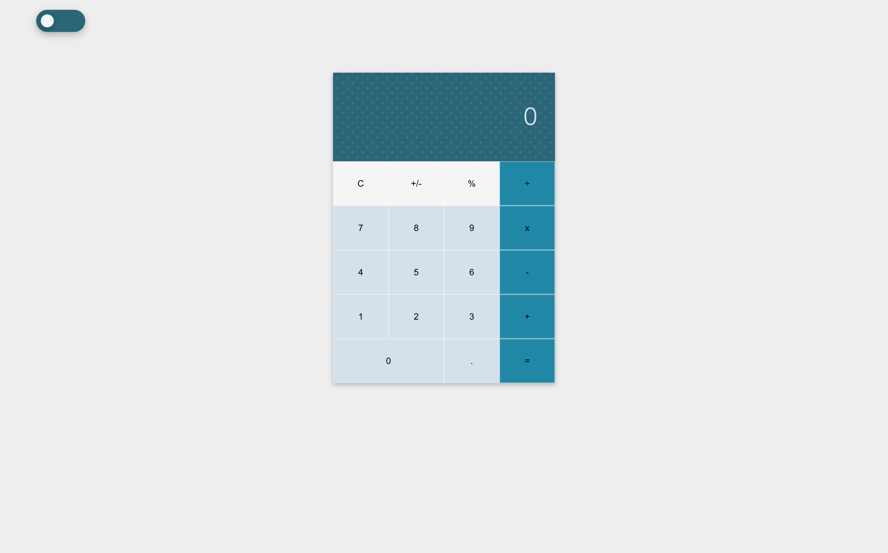
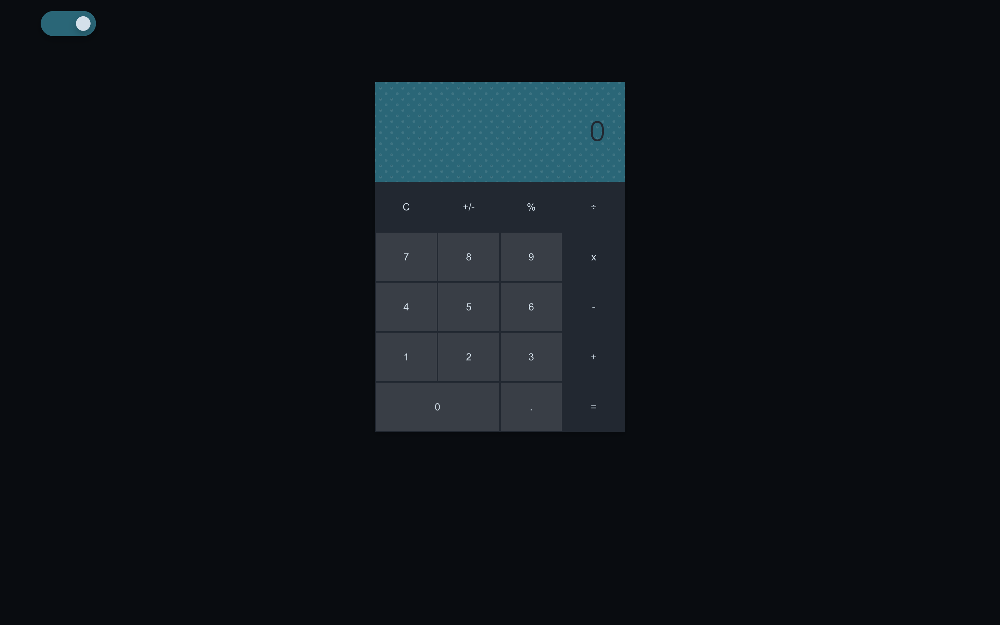
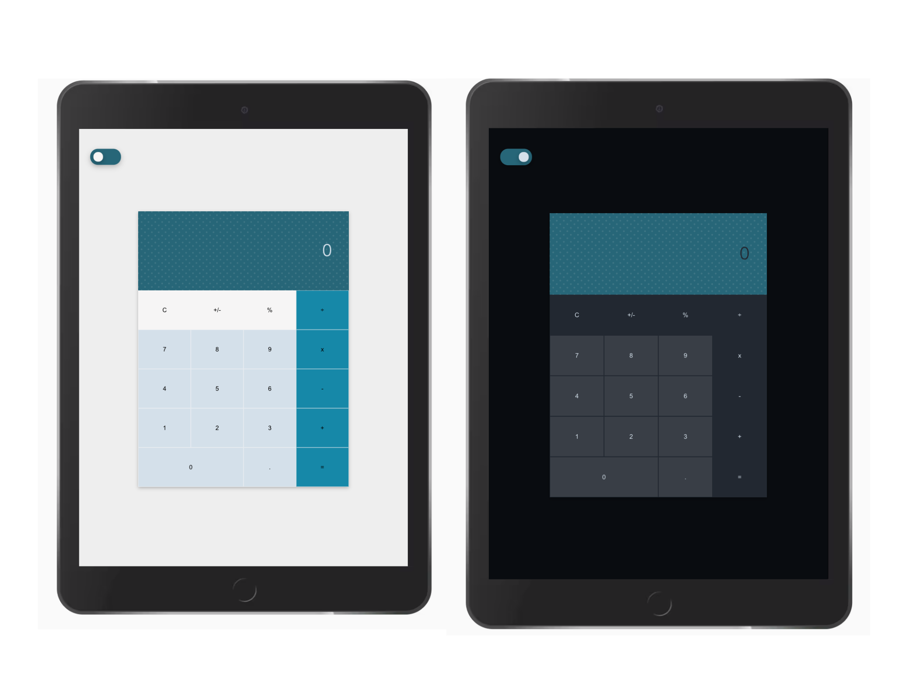
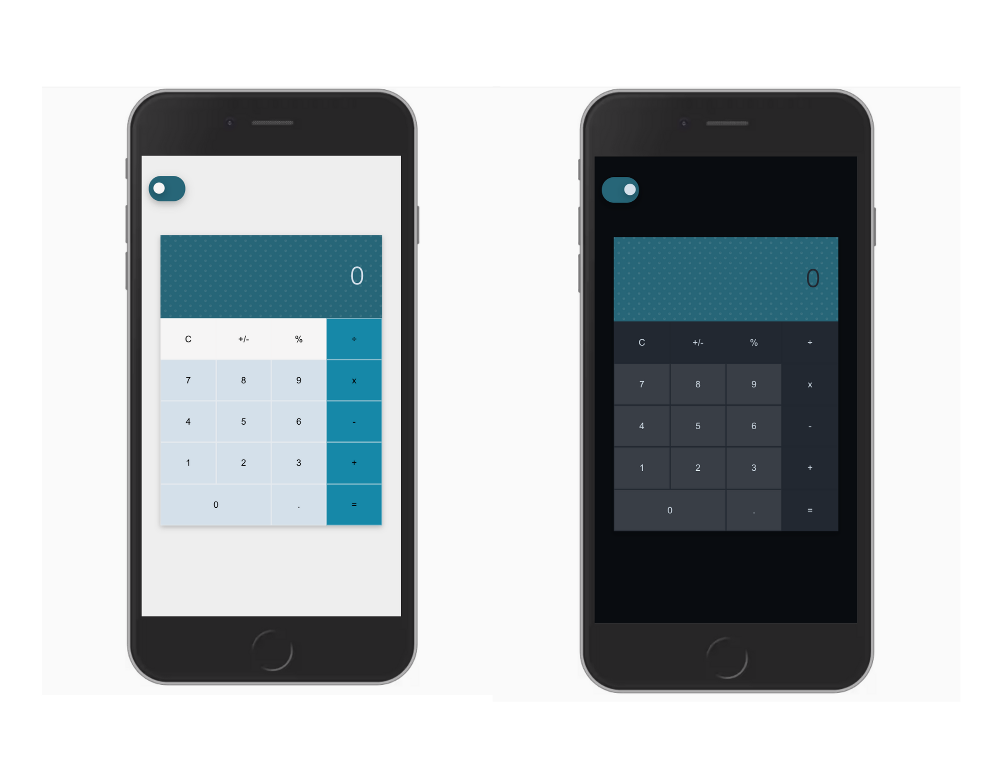

# Calculator
Simple calculator with a toggle for night mode. 
Build with Vue 2.6.11.

### Screenshots
   
   
   
   

### Setup

1. Fork and clone this repository. 
2. Install dependencies with `npm install`. 
3. Then run `npm run serve`.
4. Go to `http://localhost:8080/` in your browser.

### Dependencies

- Vue v.2.6.11
- Core-js v.3.6.5